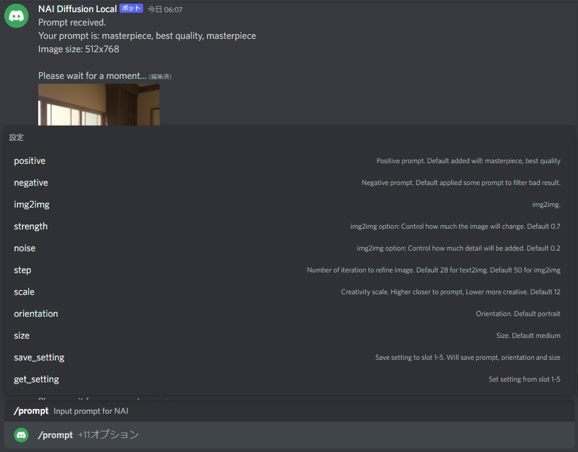
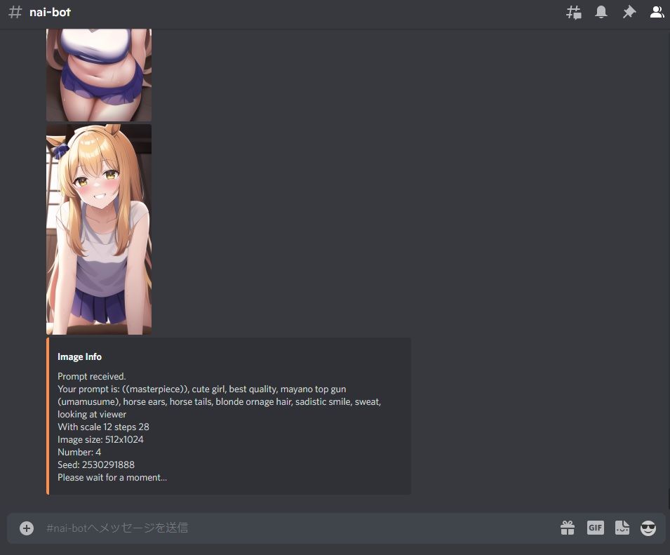

# Stable Diffusion Local Discord Bot
 
Simple discord bot to connect your local Naifu environemnt (using your own GPU).\
Originally designed for single user, and request is performed one by one (each time 1 image only).\
Calling `/prompt` in discord will ask you to input your different options.\
Exactly the same as Naifu or NovelAI.\
\
`positive` : position prompt\
`negative` : negative prompt\
`orientation`: portrait | landscape | square\
`size`: small | medium | large (please refer to config.js)\
`scale`: cfg scale\
`step`: sampling step\
`strength`: img2img option\
`noise`: img2img option\
`save_setting`: alow to save positive prompt, negative prompt, orientation and size up to 5 slot\
`get_setting`: get the setting saved to slot\

## How To Run

Run `yarn start` or `npm start` to run the bot.\
The base url is default set to `http://localhost:6969` for connecting `naifu`. Change the port to your local port.\
You should also start the stable diffusion backend program in your local environment.\
\
\

