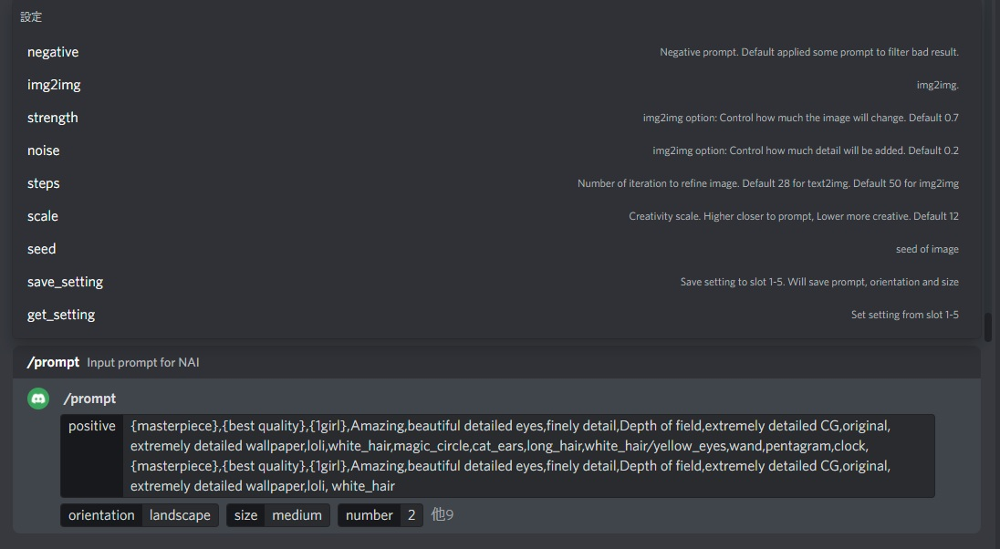
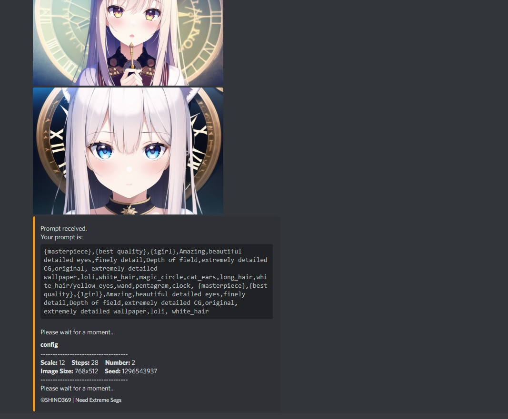

# Stable Diffusion Local Discord Bot (For Naifu)
 
Simple discord bot to connect your local Naifu environemnt (using your own GPU).\
Migrated to typescript for better error handling.\
\
`Does not work for webui as it use the backend API from naifu.`\
\
Originally designed for single user, and request is performed one by one.\
Cool down time 20s is added for prompt. To change it, set the value in config.ts.\
Calling ```/prompt``` in discord will ask you to input your different options.\
Input options exactly the same as Naifu or NovelAI.\
\
`positive` : position prompt (max 800 characters)\
`negative` : negative prompt (max 800 characters)\
`number` : number of image per generation (max 10)\
`img2img` : upload file for img2img\
`orientation`: portrait | landscape | square\
`size`: small | medium | large (please refer to config.js)\
`scale`: cfg scale\
`steps`: sampling steps (max 50)\
`strength`: img2img option (0.1 to 0.99)\
`noise`: img2img option (0.1 to 0.99)\
`seed` : seed\
`save_setting`: alow to save positive prompt, negative prompt, orientation and size up to 10 slot\
`get_setting`: get the setting saved to slot\

For img2img, it will automatically apply a suitable W x H, and max is 1024 x 1024.\

## Saving Slot
Savable setting: `positive prompt, negative prompt, orientation, size, step, scale`
## How To Run
Config your `.env` file by changing `.env.bak` to `.env` and add `token/id`.
Run ```yarn start``` or ```npm run start``` to start.\
The `deploy.ts` is non-used recently.\
The base url is default set to `http://localhost:6969` for connecting `naifu`. Change the port to your local port if needed.\
You should also start the naifu in your local environment.\
\
\


## Image Regeneration
Updated on 27 Oct 2022.\
you can regenerate image using same setting except seed number by clicking `retry` button. Old images will be replaced. The JSON is for saving setting.\
\

